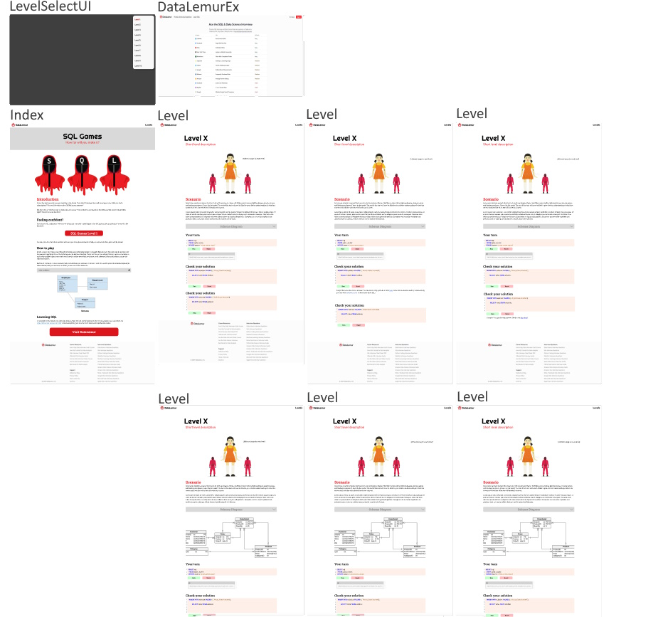

## Inspiration
This murder mystery was inspired by [SQL Murder Mystery](https://mystery.knightlab.com), and this is a clone of [that repository](https://github.com/NUKnightLab/sql-mysteries) with improvisations.

# Background Information

This game was made to be a project for DataLemur, which I worked on during an internship for the 2024 winter period. This project went through all traditional phases, including a project proposal, with a [prototype](https://www.figma.com/proto/Duv2DMNJOd8TD82SBVs9vt/SQL-Games?node-id=1-2412&p=f&scaling=min-zoom&content-scaling=fixed&page-id=0%3A1&starting-point-node-id=1%3A2412&hide-ui=1) and a presentation made to the CEO, and then implementing it. Below you will find the description of the game as well as some additional information. I hope you enjoy playing!

**Figma Prototype:**

# SQL Games

Can you beat the SQL Games!? The SQL Games are designed to be both a self-directed lesson to learn SQL concepts and commands and a fun game for experienced SQL users to solve progressively harder challenges.

If you just want to solve the mystery, go to [DataLemur/SQLGames](https://www.youtube.com/watch?v=dQw4w9WgXcQ). If you're new to SQL, you may want to start by [learning the concepts](https://datalemur.com/sql-tutorial). If you finish this, you'll not only be overprepared to win the SQLGames, but also to get a huge headstart on your career.

## Authors
* [Dylan Todd](https://www.linkedin.com/in/dylan-j-todd)
* [Joon Park](https://twitter.com/JoonParkMusic)
* [Cathy He](https://twitter.com/Cathy_MeiyingHe)

## Copyright and License
Original code for this project is released under [the MIT License](LICENSE). 
Original text and other content is released under [Creative Commons CC BY-SA 4.0](https://creativecommons.org/licenses/by-sa/4.0/). 
